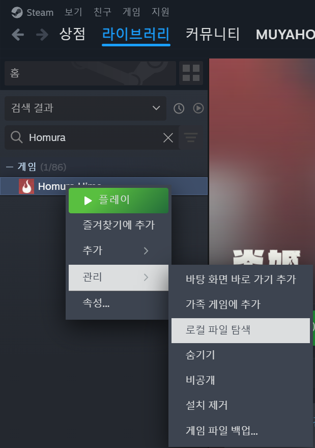
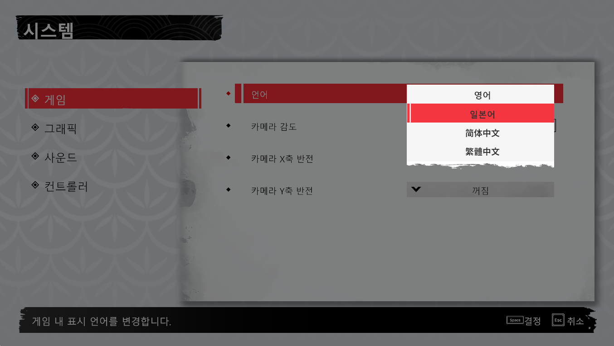

## 호무라 히메(Homura Hime)

<section class="game-meta" aria-label="Homura Hime 게임 정보">
  

    Game Data
  

  <dl>
    

      <dt>게임</dt>
      <dd>호무라 히메(Homura Hime)</dd>
    

    

      <dt>출시일</dt>
      <dd>2026년 3월 4일</dd>
    

    

      <dt>개발</dt>
      <dd>Crimson Dusk</dd>
    

    

      <dt>퍼블리셔</dt>
      <dd>PLAYISM</dd>
    

    

      <dt>장르</dt>
      <dd>3D 액션</dd>
    

    

      <dt>플랫폼</dt>
      <dd>Steam</dd>
    

  </dl>
</section>

호무라 히메(Homura Hime)는 대만 인디 스튜디오 Crimson Dusk가 개발하고 PLAYISM이 퍼블리싱한 3D 액션 게임입니다. Steam 버전은 2026년 3월 4일에 출시되었습니다.

애니메이션풍 비주얼과 빠른 근접 전투, 탄막 회피를 결합한 게임으로, 플레이어는 퇴마사 호무라 히메가 되어 강한 감정에 사로잡힌 악마들과 맞서 싸우게 됩니다.

관련 페이지는 <a href="https://store.steampowered.com/app/1820000/Homura_Hime/" target="_blank" rel="noopener noreferrer">Steam 상점 페이지</a>와 <a href="https://playism.com/en/game/homura-hime/" target="_blank" rel="noopener noreferrer">PLAYISM 공식 페이지</a>에서 확인할 수 있습니다.

## 업데이트 적용 방법

### 1. 설치 폴더 열기

먼저 Steam에서 호무라 히메(Homura Hime)가 설치된 폴더를 엽니다. Steam 라이브러리에서 게임을 선택한 뒤, 위 이미지처럼 로컬 파일 위치로 이동하면 됩니다.

### 2. 번역 파일 적용하기

<a href="https://drive.google.com/drive/folders/1WrIeG9XR7ZzZJzMt6FirchHgUr2A69fe?hl=ko" target="_blank" rel="noopener noreferrer">호무라 히메 한글 번역 파일 다운로드</a>

번역 파일을 다운로드한 뒤 압축을 풀어 주세요. 압축을 풀면 나오는 `dist` 폴더 안의 내용을 Homura Hime 설치 폴더에 붙여넣으면 됩니다. 기존 파일을 덮어쓸지 묻는 창이 나오면 덮어쓰기를 선택해 주세요.

### 3. 게임 내 언어 설정하기

설치가 끝났다면 게임을 실행하고 메인 화면에서 설정 메뉴로 들어갑니다.

설정 화면에서 언어 항목을 찾은 뒤, 이미지처럼 언어를 일본어로 변경합니다. 현재 한글 번역은 일본어 텍스트를 기준으로 적용되므로, 다른 언어로 설정되어 있으면 번역이 보이지 않을 수 있습니다.
